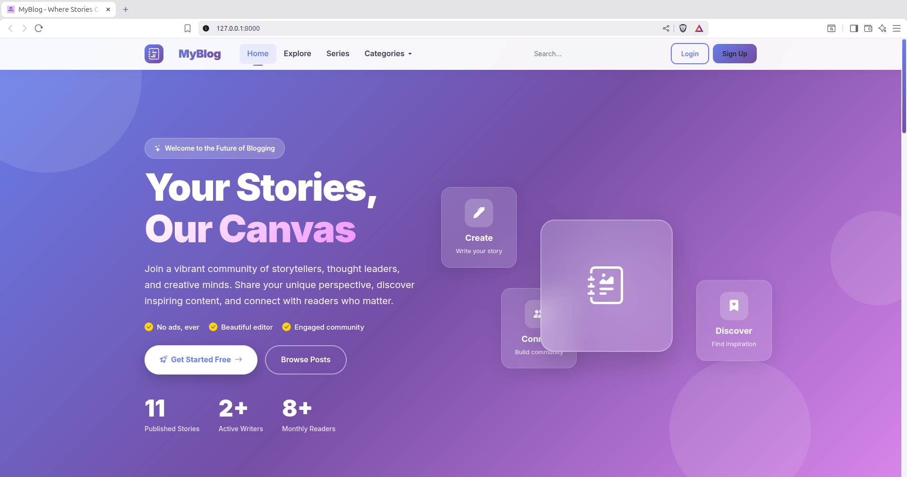
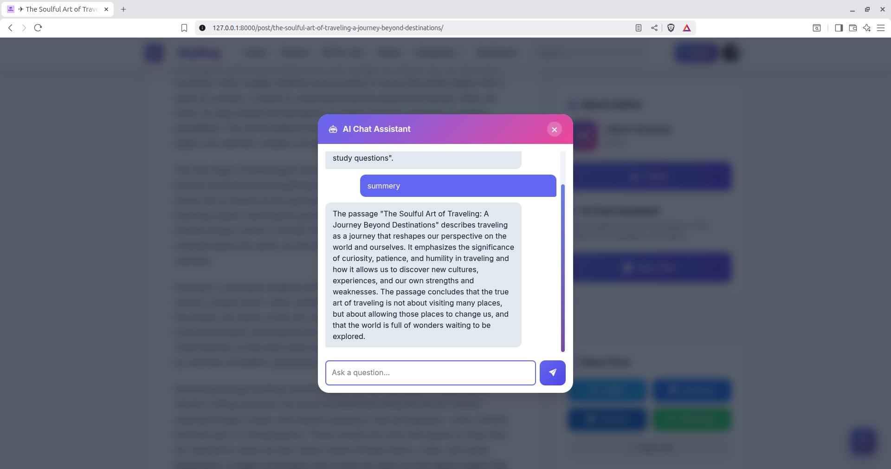
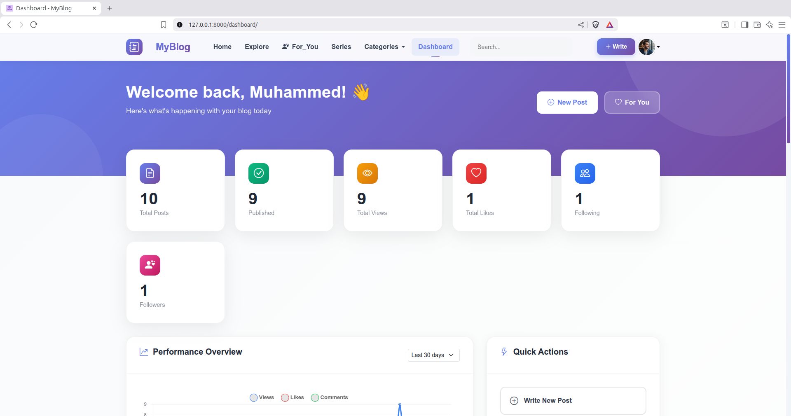
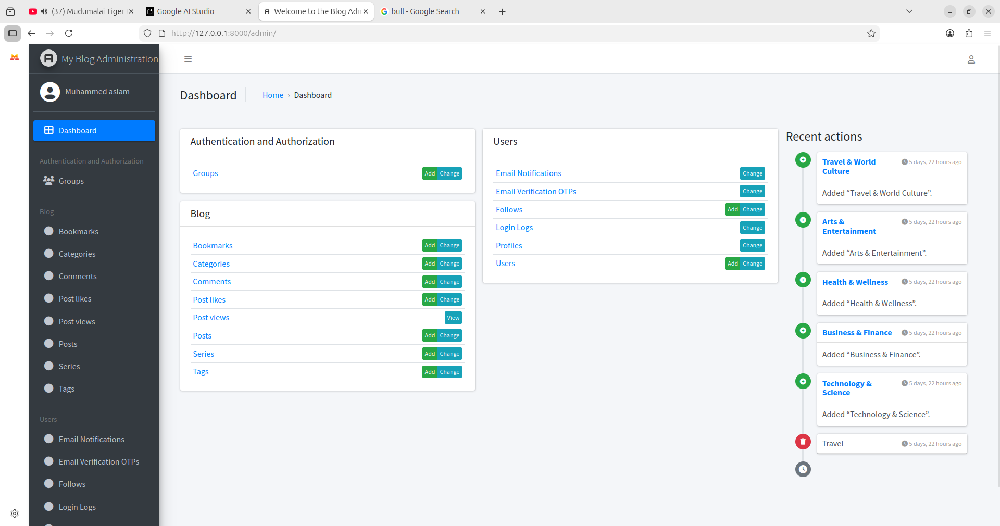

```markdown
# 🚀 MyBlog: AI-Powered Real-Time Blogging Platform


**MyBlog** is a next-generation, open-source blogging platform designed to enhance the reading and writing experience through **Artificial Intelligence** and **Real-Time Communication**.

Unlike traditional CMS platforms, MyBlog features a **RAG (Retrieval-Augmented Generation) Chatbot** that allows readers to interactively "chat" with articles. The system also automates content organization using the **Groq API** and handles real-time notifications via **WebSockets** running on an **ASGI** architecture.

---

## 📑 Table of Contents
- [✨ Key Features](#-key-features)
- [🏗️ System Architecture](#️-system-architecture)
- [🛠️ Tech Stack](#️-tech-stack)
- [⚙️ Installation & Setup](#️-installation--setup)
- [🏃‍♂️ Run the Application](#️-run-the-application)
- [🔑 Environment Variables](#-environment-variables)
- [🤖 How the AI Works (RAG)](#-how-the-ai-works-rag)
- [📂 Project Structure](#-project-structure)
- [📸 Screenshots](#-screenshots)

---

## ✨ Key Features

### 🧠 Intelligent Automation (AI)
*   **Chat with Post:** An embedded AI assistant that answers user questions *specifically* based on the blog post's content using **RAG** and **Cosine Similarity**.
*   **Auto-Tagging:** Automatically analyzes post content to generate relevant SEO tags.
*   **Auto-Categorization:** Classifies posts into topics (Technology, Health, etc.) without manual input.
*   **Summarization:** Provides instant summaries for long-form content.

### ⚡ Real-Time & Social
*   **WebSocket Notifications:** Live alerts for new followers, likes, and comments (Powered by **Django Channels**).
*   **Live Chat Response:** The AI chatbot streams answers token-by-token (Typing effect).
*   **Nested Comments:** Reddit-style threaded discussions.
*   **Follow System:** Personalized **"For You"** feed based on authors followed.

### 📝 Content Management
*   **Series Support:** Organize related posts into a sequential playlist (e.g., "Python Tutorial Part 1, Part 2").
*   **Rich Text Editor:** WYSIWYG editing with image support (CKEditor 5).
*   **Role-Based Access:** Admin, Staff, and Verified User roles.
*   **Security:** Email OTP verification and secure password hashing.

---

## 🏗️ System Architecture

The project follows a **Hybrid Modular Monolithic** architecture optimized for performance:

1.  **Daphne/ASGI:** Handles asynchronous WebSocket connections for the Chatbot and Notifications.
2.  **Django Channels:** Manages real-time protocols and groups.
3.  **Redis:** Acts as the **Channel Layer** (message bus) and **Celery Broker**.
4.  **Celery:** Handles background tasks (sending emails, generating vector embeddings) to keep the UI responsive.
5.  **Groq API:** Provides high-speed LLM inference (Llama-3.1) for tagging and chat.

---

## 🛠️ Tech Stack

| Component | Technology |
| :--- | :--- |
| **Backend Framework** | Django 5.0 (Python) |
| **ASGI Server** | Daphne |
| **Real-Time Layer** | Django Channels |
| **Database** | SQLite (Dev) / PostgreSQL (Prod) |
| **AI LLM** | Groq API (Llama-3.1-8B-Instant) |
| **Vector Embeddings** | Sentence-Transformers (`all-MiniLM-L6-v2`) |
| **Task Queue** | Celery |
| **Message Broker** | Redis |
| **Frontend** | HTML5, JavaScript, Bootstrap |

---

## ⚙️ Installation & Setup

Follow these steps to run the project locally.

### 1. Prerequisites
*   Python 3.10+
*   Redis Server (Must be installed and running)
*   Git

### 2. Clone the Repository
```bash
git clone  https://github.com/Muhammedaslamkerala/myblog.git
cd myblog
```

### 3. Create Virtual Environment
```bash
python -m venv venv
# Windows
venv\Scripts\activate
# Mac/Linux
source venv/bin/activate
```

### 4. Install Dependencies
```bash
pip install -r requirements.txt
```

### 5. Database Setup
```bash
python manage.py makemigrations
python manage.py migrate
```

### 6. Create Admin User
```bash
python manage.py createsuperuser
```

---

## 🏃‍♂️ Run the Application

Because this is a real-time, asynchronous application, you need to run **three services** in separate terminals.

### Terminal 1: Redis Server
*Required for WebSockets and Background Tasks.*
```bash
redis-server
```

### Terminal 2: Celery Worker
*Handles AI processing and Emails in the background.*
```bash
# Windows
celery -A main worker -l info --pool=solo

# Mac/Linux
celery -A main worker -l info
```

### Terminal 3: Web Server
You can choose either Option A or Option B.

**Option A: Development Mode (Recommended for testing)**
Django's built-in `runserver` will automatically detect the ASGI configuration.
```bash
python manage.py runserver
```

**Option B: Production Simulation (Professional)**
Run using **Daphne** directly to simulate a production ASGI environment.
```bash
daphne -b 0.0.0.0 -p 8000 main.asgi:application
```

*Access the app at `http://127.0.0.1:8000/`*

---

## 🔑 Environment Variables

Create a `.env` file in the root directory and add your keys:

```ini
# Core Django
SECRET_KEY=your_secret_key
DEBUG=True

# Database (Optional - defaults to SQLite if left empty)
DB_NAME=myblog_db
DB_USER=postgres
DB_PASSWORD=password
DB_HOST=localhost

# AI Configuration (Get key from console.groq.com)
GROQ_API_KEY=gsk_your_groq_api_key

# Email Settings (For OTP)
EMAIL_HOST_USER=your_email@gmail.com
EMAIL_HOST_PASSWORD=your_app_password
```

---

## 🤖 How the AI Works (RAG)

1.  **Ingestion:** When an author saves a post, **Celery** chunks the text into 500-character segments.
2.  **Embedding:** The `SentenceTransformer` model converts these chunks into vector embeddings (numbers representing meaning).
3.  **Storage:** Vectors are stored in the database JSON field.
4.  **Retrieval:** When a user asks a question, the system vectorizes the question and finds the **top 3 matching chunks** from the post.
5.  **Generation:** These chunks + the question are sent to **Groq (Llama 3)**, which generates a strictly context-aware answer.

---

## 📂 Project Structure

```bash
myblog_project/
├── myblog_project/      # Settings & ASGI/WSGI Config
├── users/               # CustomUser, Profiles, Follows, Auth
├── blog/                # Posts, Comments, Series, AI Logic
├── templates/           # HTML Files
├── static/              # CSS, JS, Images
├── manage.py
└── requirements.txt
```

---

## 📸 Screenshots

<!-- Upload images to a 'screenshots' folder in your repo or use generic links -->

| **Home Feed** | **AI Chat Interface** |
|:---:|:---:|
|  |  |

| **Dashboard** | **Admin Panel** |
|:---:|:---:|
|  |  |

---

## 📄 License

This project is licensed under the **MIT License**.

---

### 👨‍💻 Developed By
**Muhammed Aslam**
*Final Year Computer Science Project*
*Kannur University*
```