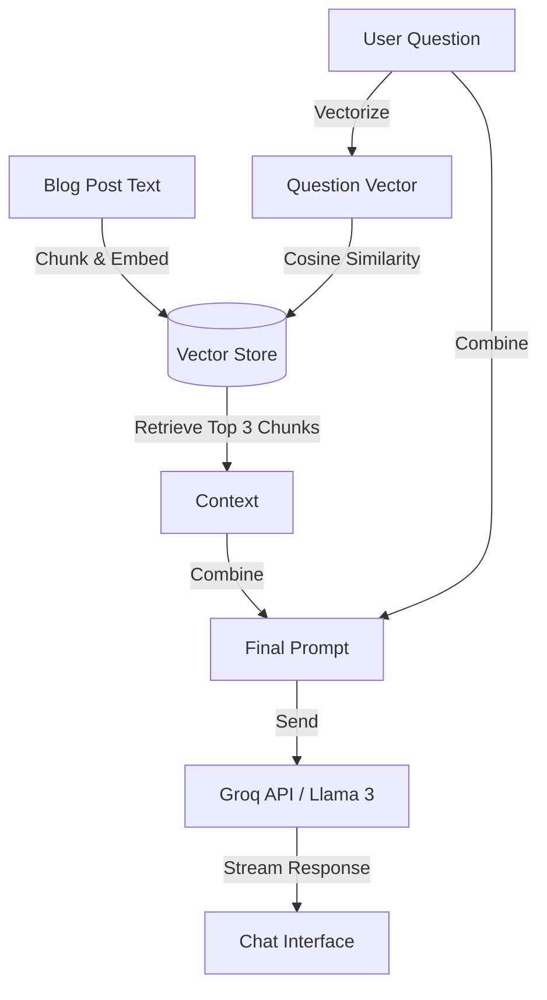

```markdown
# 🤖 AI Capabilities & RAG Architecture

**MyBlog** integrates advanced Artificial Intelligence to transform a standard blogging platform into an intelligent knowledge base. This document details the technical implementation of the **RAG (Retrieval-Augmented Generation)** chatbot, automated tagging, and classification systems.

## 🧠 The AI Tech Stack

| Component | Technology Used | Purpose |
| :--- | :--- | :--- |
| **LLM Inference** | **Groq API** (Llama-3.1-8B-Instant) | Ultra-fast text generation, tagging, and summarization. |
| **Embeddings** | **Sentence-Transformers** (`all-MiniLM-L6-v2`) | Converting text into vector representations locally. |
| **Vector Search** | **NumPy / Cosine Similarity** | Finding relevant context chunks for RAG. |
| **Task Queue** | **Celery** | Handling embedding generation asynchronously. |

---

## 🔍 Feature 1: "Chat with Post" (RAG System)

The flagship feature of MyBlog is the ability for readers to ask questions to a specific blog post. Unlike generic AI chatbots, this system answers **strictly based on the content of the article**, reducing hallucinations.

### ⚙️ The Workflow

1.  **Ingestion & Chunking:**
    *   When an author saves a post, the `body` text is cleaned (HTML tags removed).
    *   The text is split into semantic chunks of approximately **500 characters** with a 50-character overlap to preserve context.

2.  **Vector Embedding Generation:**
    *   A background **Celery task** processes these chunks using the `sentence-transformers` model.
    *   Each chunk is converted into a **384-dimensional vector** (list of floating-point numbers).
    *   These vectors are stored in a `JSONField` within the `Post` model.

3.  **Retrieval (The "R" in RAG):**
    *   When a user asks a question via the WebSocket chat interface:
        1.  The question is converted into a vector.
        2.  We calculate the **Cosine Similarity** between the question vector and all chunk vectors of that specific post.
        3.  The top **3 most similar chunks** are retrieved.

4.  **Generation (The "G" in RAG):**
    *   We construct a prompt including the retrieved chunks as "Context".
    *   The prompt is sent to the **Groq API (Llama 3)**.
    *   *System Prompt:* "You are a helpful assistant. Answer the user's question using ONLY the context provided below."

### 📐 RAG Diagram



---

## 🏷️ Feature 2: Automated Content Organization

To reduce the manual workload for creators, MyBlog automates metadata generation.

### 1. Auto-Tagging
*   **Trigger:** Post Creation/Update.
*   **Process:** The full article text is sent to Llama 3 with a prompt to extraction 5-8 relevant SEO keywords.
*   **Output:** Returns a JSON list of tags (e.g., `["Django", "WebSockets", "AI"]`) which are automatically created and assigned to the post.

### 2. Intelligent Categorization
*   **Process:** The AI analyzes the sentiment and topic of the post.
*   **Classification:** It maps the content to a predefined list of categories (e.g., *Technology, Health, Finance, Lifestyle*).
*   **Result:** The post is automatically filed under the most relevant section.

---

## 📝 Feature 3: Smart Summarization

For long-form content, MyBlog offers a "Distraction-Free Read Mode" that includes an AI-generated summary.

*   **Logic:** The AI condenses the article into a 3-sentence "TL;DR" (Too Long; Didn't Read) abstract.
*   **Implementation:** This runs asynchronously via Celery to ensure the page load time remains fast for the author.

---

## 🚀 Performance Optimization

### Why Groq?
We utilize the **Groq API** because of its LPU (Language Processing Unit) architecture, which delivers inference speeds of **~300 tokens/second**. This allows the "Chat with Post" feature to feel instantaneous, almost like a real-time conversation.

### Asynchronous Processing
Generating vector embeddings is CPU-intensive. By offloading this to **Celery**, the web server (Daphne/Django) remains free to handle incoming HTTP and WebSocket requests without locking up.

---

## 🔮 Future AI Improvements

*   **Hybrid Search:** Combining Keyword search (BM25) with Vector search for better accuracy.
*   **Voice Interaction:** Adding Speech-to-Text to allow users to speak to the blog post.
*   **Multi-Modal RAG:** Allowing the AI to "see" images inside the blog post to answer questions about diagrams or photos.
```